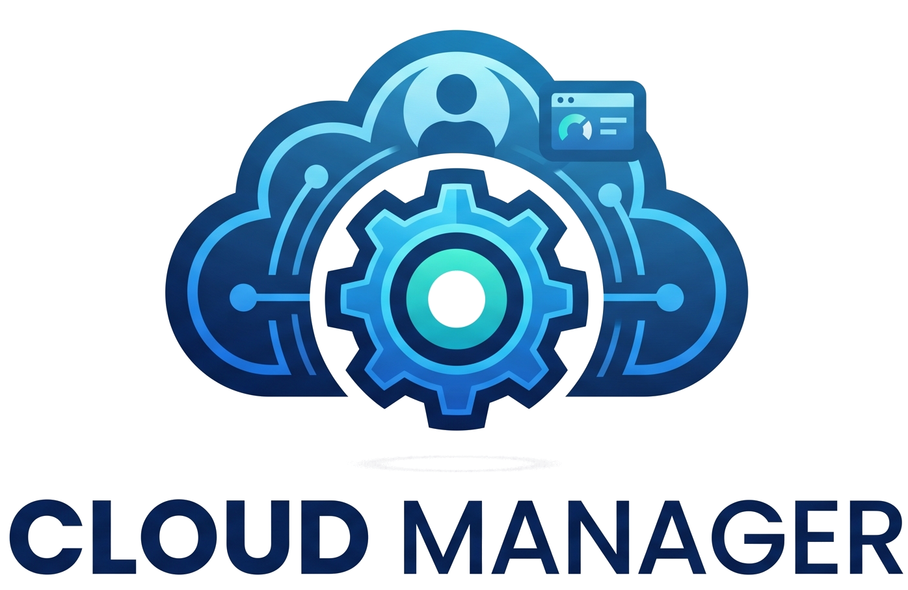

<p align="center">
  
</p>

# Cloud Manager

Cloud Manager menyediakan antarmuka pengelolaan file di dalam direktori tertentu dan dapat digunakan untuk mengunggah, menghapus, melihat pratinjau, dan mengedit file Anda. Ini adalah perangkat lunak jenis **buat cloud Anda sendiri** di mana Anda cukup menginstalnya di server Anda, mengarahkannya ke suatu jalur, dan mengakses file Anda melalui antarmuka web yang bagus.

## Mulai Cepat (Quick Start)

Cara paling mudah untuk menjalankan **Cloud Manager** adalah menggunakan Docker Compose. Buat file `compose.yaml` (atau gunakan yang sudah disediakan) dan jalankan:

```bash
docker compose up -d
```

## Cara Login Default

Saat aplikasi pertama kali dijalankan, sistem akan otomatis membuatkan database baru dengan kredensial default berikut:

* **URL Akses:** `http://localhost:8000` (atau port sesuai konfigurasi kamu)
* **Username:** `admin`
* **Password:** `admin@123456`

> **Penting:** Pastikan kamu segera mengubah password default ini di menu *Settings > User Management* setelah berhasil login pertama kali.

## License

[Apache License 2.0](LICENSE) © File Browser Contributors
